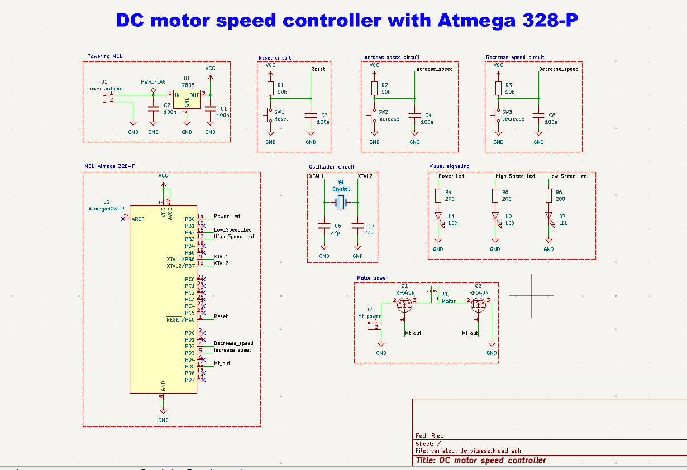
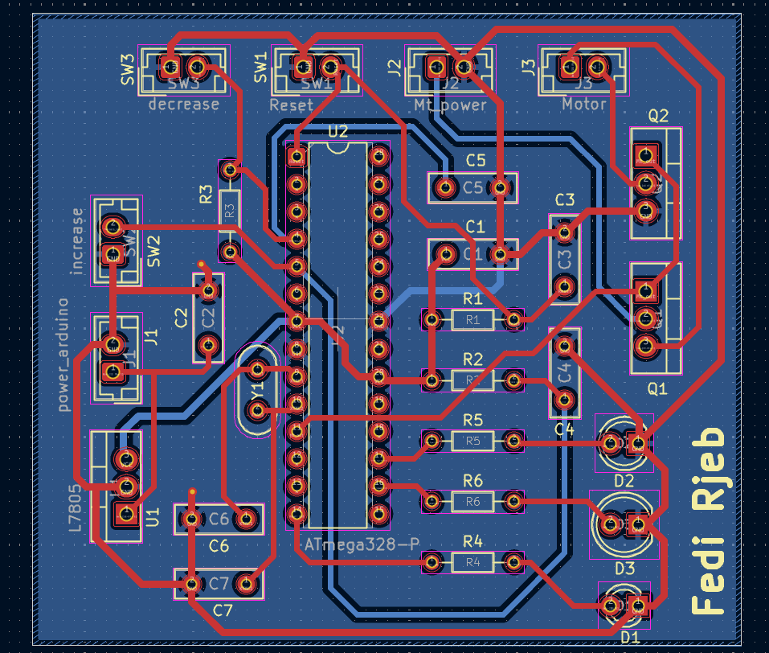
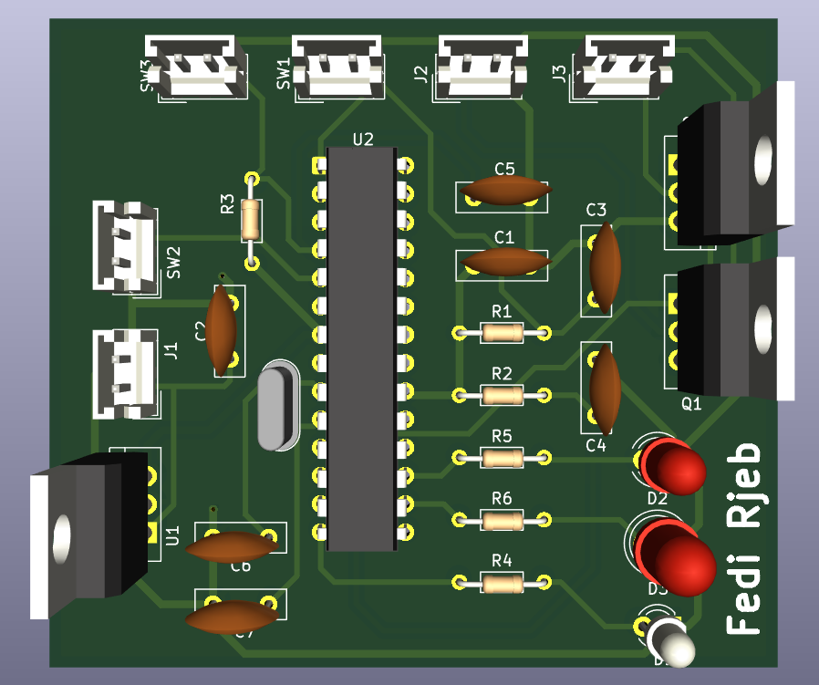

# DC Motor Speed Controller (ATmega328P + KiCad)

### Overview
Designed and built a compact DC motor speed controller using ATmega328P.  
The project focused on stable power regulation, precise motor control, and clean PCB design for easy debugging and reliability.

### Design Highlights
- Stable 5V power supply with **LM7805 regulator**
- Three user control circuits:
  - Reset
  - Speed Increase
  - Speed Decrease  
  *(each with indicator LEDs)*
- **MOSFET-based switching** for reliable motor speed modulation
- **16 MHz crystal oscillator** for precise clocking of the microcontroller
- Optimized PCB routing and component placement for performance and debugging
- Simulated and validated using **Proteus (ISIS)** before implementation

### Tech Stack
ATmega328P, KiCad, Proteus (ISIS), MOSFETs, LM7805 Regulator, Crystal Oscillator

### Media
- 📸 Schematic: 
- 📸 PCB Layout (2D): 
- 📸 PCB 3D Render: 

### Key Learnings
This project consolidated embedded design practices:
- Power regulation and stability
- Integration of user control circuits
- Motor control with microcontrollers
- End-to-end workflow: **Simulation → PCB Design → Testing**
